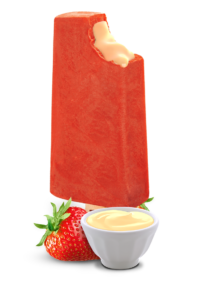

## El geladon

## Descrição
Esse projeto foi realizado para o consumo de API El Geladon, do curso da Blue EdTech módulo III. 

## Link do projeto

## Stacks
Ferramentas usadas:

API do El Geladon:

